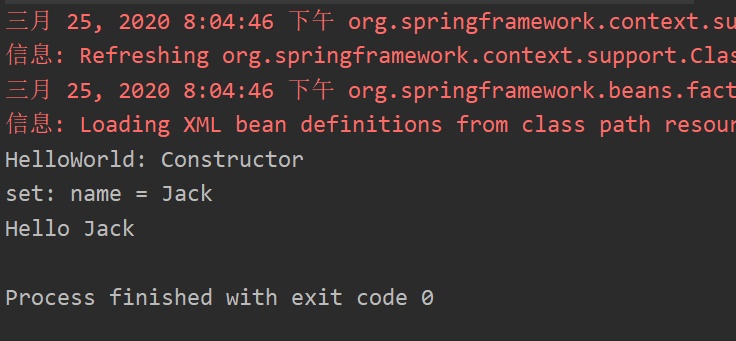
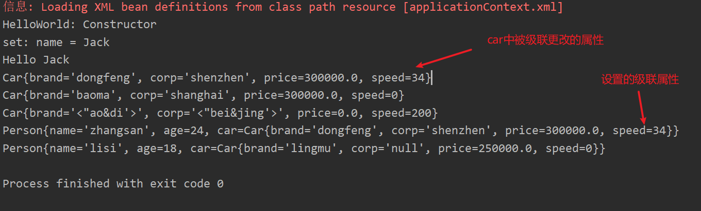

## 1、Spring HelloWorld
1. 对象的创建和初始化可以交由Spring去管理

2. 在创建Spring的IOC容器对象时就会对所有的在applicationContext.xml中注册的bean进行创建和初始化

   

### 1.1、依赖注入的方式

#### 1.1.1、属性注入

```xml
 <bean id="helloWorld" class="com.xzw.helloworld.HelloWorld">
     <property name="name2" value="Jack"/>
</bean>
```

#### 1.1.2、构造器注入

```java
public class Car {

    private String brand;
    private String corp;
    private double price;
    private int speed;

    public Car(String brand, String corp, double price) {
        this.brand = brand;
        this.corp = corp;
        this.price = price;
    }

    public Car(String brand, String corp, int speed) {
        this.brand = brand;
        this.corp = corp;
        this.speed = speed;
    }

    @Override
    public String toString() {
        return "Car{" +
                "brand='" + brand + '\'' +
                ", corp='" + corp + '\'' +
                ", price=" + price +
                ", speed=" + speed +
                '}';
    }
}
```

```xml
<beans>
<!-- 依赖注入的方式之构造器注入-->
<!-- 按照顺序 -->
<bean id="car" class="com.xzw.helloworld.Car">
    <constructor-arg value="dongfeng" />
    <constructor-arg value="shenzhen" />
    <constructor-arg value="300000" />
</bean>

<!-- 通过指定类型或name判断使用那个构造器 -->
<bean id="car2" class="com.xzw.helloworld.Car">
    <constructor-arg value="shanghai" name="corp" />
    <constructor-arg value="baoma" name="brand" />
    <constructor-arg value="300000" type="double" />
</bean>

<!-- 通过指定类型或index判断使用那个构造器 -->
<bean id="car3" class="com.xzw.helloworld.Car">
    <constructor-arg value="beijing" index="1" />
    <constructor-arg value="aodi" index="0" />
    <constructor-arg value="200"  type="int" />
</bean>
</beans>
```

#### 1.1.3、bean之间的引用

```xml
<beans>
    <bean id="car" class="com.xzw.helloworld.Car">
        <constructor-arg value="dongfeng" />
        <constructor-arg value="shenzhen" />
        <constructor-arg value="300000" />
    </bean>
    
    <!-- 用ref指定bean之间的引用 -->
    <bean id="person" class="com.xzw.helloworld.Person">
        <property name="name" value="zhangsan" />
        <property name="age" value="24" />
        <property name="car" ref="car" />
        <!-- 级联属性，需要person类提供Car的getter方法，而且car必须首先存在，不能为NULL -->
        <property name="car.speed" value="34" />
    </bean>

    <bean id="person2" class="com.xzw.helloworld.Person">
        <constructor-arg value="lisi" />
        <constructor-arg value="18" />
        <!-- 内部bean只能在内部使用，不能被外部引用 -->
        <constructor-arg>
            <bean class="com.xzw.helloworld.Car">
                <property name="brand" value="lingmu" />
                <!-- 使用null值 -->
                <property name="corp"><null /></property>
                <property name="price" value="250000" />
            </bean>
        </constructor-arg>
    </bean>
</beans>
```



#### 1.1.4、集合属性的注入

```xml
<beans>
    <!-- 集合list的配置 -->
    <!-- 需要引入 p 命名空间，可以简化bean的配置 -->
    <bean id="person3" class="com.xzw.helloworld.Person" p:name="wangwu" p:age="18">
        <property name="knownCars">
            <list>
                <ref bean="car"/>
                <ref bean="car2"/>
                <ref bean="car3"/>
            </list>
        </property>
    </bean>
    
    <!-- 集合Map的配置 -->
    <bean id="person5" class="com.xzw.helloworld.Person" p:name="sunqi" p:age="19">
        <property name="drivingCars">
            <map>
                <entry key="Monday" value-ref="car"/>
                <entry key="Friday" value-ref="car2"/>
                <entry key="Sunday" value-ref="car3"/>
            </map>
        </property>
    </bean>
    
    <!-- Properties的配置 -->
    <bean id="dataSource" class="com.xzw.helloworld.DataSource">
        <property name="properties">
            <props>
                <prop key="user">xzw</prop>
                <prop key="password">12345678</prop>
                <prop key="url">jdbc:mysql://test</prop>
                <prop key="driver">com.mysql.cj.jdbc.driver</prop>
            </props>
        </property>
    </bean>
    
    <!-- 需要引入util命名空间，可以配置出一个集合bean -->
    <util:list id="knownCars1">
        <ref bean="car"/>
        <ref bean="car2"/>
    </util:list>
    <bean id="person4" class="com.xzw.helloworld.Person" p:name="liuliu" p:age="13" p:knownCars-ref="knownCars1"/>
</beans>
```

#### 1.1.5、命名空间 p

```xml
<bean id="person4" class="com.xzw.helloworld.Person" p:name="liuliu" p:age="13" p:knownCars-ref="knownCars1"/>
```


## 2、Spring Helloworld2

### 2.1、bean的自动装配

1. 可分为byName和byType两种类型
   1. byName要求被装配的bean的id和setter方法名一样
   2. byType要求被装配的bean的类型只有此一个

```xml
<beans>
    <!-- bean 的自动装配 -->
    <bean id="car" class="com.xzw.helloworld2.Car"
          p:brand="BaoMa" p:price="300000"/>

    <bean id="address" class="com.xzw.helloworld2.Address"
          p:city="beijing" p:street="WuDaoKou"/>

    <bean id="person" class="com.xzw.helloworld2.Person"
          p:name="Jack" autowire="byName"/>
</beans>
```

### 2.2、bean之间的关系

```xml
<beans>
    <!--
        bean之间的关系：
             1. 继承关系：指bean配置的继承关系，子bean可以继承父bean的属性配置
             2. 依赖关系：值被依赖的bean会先被实例化
    -->
    <bean id="address2" class="com.xzw.helloworld2.Address"
          p:city="beijing" p:street="WuDaoKou"/>

    <bean id="address3" parent="address2" p:street="HuiLongSi"/>

    <!-- 表示car要在person2之前实例化 -->
    <bean id="person2" class="com.xzw.helloworld2.Person"
          p:name="Jane" depends-on="car" />
</beans>
```

### 2.3、bean的作用域

```xml
<beans>
    <!--
        bean 的作用域：
            默认为 singleton：bean在初始化容器时被创建，每次请求获得同一个bean
            prototype：bean在初始化容器时不创建，每次请求时再创建一个新的bean
    -->
    <bean id="car2" class="com.xzw.helloworld2.Car" p:brand="Baoma" p:price="200000"/>
    <bean id="car3" class="com.xzw.helloworld2.Car" p:price="300000" p:brand="jinlin" scope="prototype"/>
</beans>
```

### 2.4、使用外部属性配置文件

```xml
<beans>
	<!-- 使用外部属性配置文件，需要引入context命名空间 -->
    <!-- 首先引入配置文件 -->
    <context:property-placeholder location="application.properties"/>

    <bean id="car4" class="com.xzw.helloworld2.Car" p:brand="${brand}" p:price="${price}"/>
</beans>
```

## 3、Spring HelloWorld3

### 3.1、使用SpEL

```xml
<beans>
	<!-- 使用SpEL -->
    <bean id="address" class="com.xzw.helloworld3.Address" p:city="Beijing" p:street="WuDaoKou"/>
    <!-- 使用SpEL引用类的静态属性 -->
    <bean id="car" class="com.xzw.helloworld3.Car" p:brand="Audi" p:price="300000"
          p:tyrePerimeter="#{T(java.lang.Math).PI * 20}"/>
    <!-- 使用SpEL引用其他的bean -->
    <!-- 使用SpEL引用其他bean的属性 -->
    <!-- 使用SpEL三目运算符 -->
    <bean id="person" class="com.xzw.helloworld3.Person" p:name="ZhangSan" p:car="#{car}" p:city="#{address.city}" p:info="#{car.price >= 250000 ? '金领' : '白领'}"/>
</beans>
```